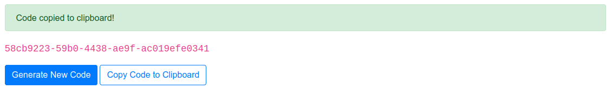

# dash-clipboard-demo
A simple application demonstrating how to use a client side callback to copy text to the clipboard in a Dash application.



The **Generate New Code** button triggers a server-side callback to generate a random code using the `uuid.uuid4()` function.  The **Copy Code to Clipboard** button triggers a client-side callback that copies the code to the clipboard using a JavaScript function. It also triggers a server-side callback to display the *Text copied to clipboard* alert.

The client-side callback is defind as follows:

```python
copy_to_clipboard_js = """
function copyStringToClipboard (nClicks, text) {
    var el = document.createElement('textarea');
    el.value = text;
    el.setAttribute('readonly', '');
    el.style = {position: 'absolute', left: '-9999px'};
    document.body.appendChild(el);
    el.select();
    document.execCommand('copy');
    document.body.removeChild(el);
}"""

app.clientside_callback(
    copy_to_clipboard_js,
    Output("dummy_output", "children"),
    Input("copy_button", "n_clicks"),
    State("text_to_copy", "children"),
)
```

The `copy_to_clipboard_js` variable defines the [JavaScript function](https://techoverflow.net/2018/03/30/copying-strings-to-the-clipboard-using-pure-javascript/) that copies the code to the clipboard on the client-side.  This function definition is passed to the `app.clientside_callback` function, along with the usual `Output`, `Input` and optional `State` passed to Dash callbacks.

Here, the `Input` is attached to the button's `n_clicks` property so the callback it triggered when the button is pressed. The `n_click` property is passed as the first argument to the JavaScript function but is not used by the function. The `State` is used to pass the code text to be copied to the second argument of the JavaScript function.  The `Output` of the callback is set to a dummy `html.Div` element in the layout. The JavaScript function does not return any value, however it is required that the callback have an output, hence the use of a dummy output.

The diagram below shows the callback logic with the client-side callback highlighted. The dashed arrow represents the `State` relationship between the `text_to_copy` element and the client-side callback.

